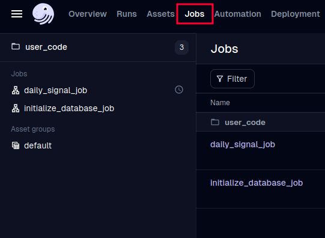
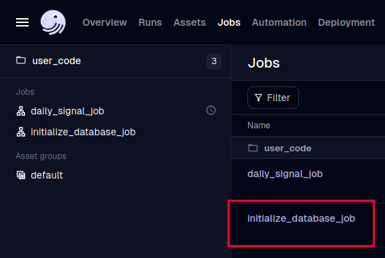
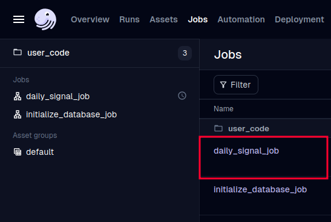
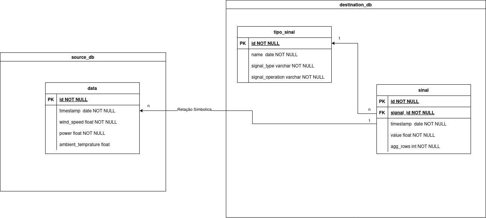

# Roteiro de Instalação e Execução

Este documento apresenta o conceito da aplicação e as instruções para executá‑la localmente.
## 1. Pré‑requisitos

- Docker e Docker Compose instalados.

Documentação de instalação:

1. Docker: https://docs.docker.com/get-started/get-docker/
2. Docker Compose: https://github.com/docker/compose

## 2. Clonar o repositório
```
git clone https://github.com/LucasEmanoel/technical_ch_paggo.git && cd ./technical_ch_paggo
```
## 3. Verificar instalação do Docker e Compose

Confirme que ambos estão disponíveis na sua máquina:
```
docker --version
docker-compose --version
```
Se algum deles não estiver instalado, siga os links acima.
## 4. Subir os containers

No diretório raiz do projeto(onde se encontra o arquivo docker-compose.yml), execute:
```
docker-compose up -d
```
Isso irá criar e iniciar os containers em segundo plano.
## 5. Inicializar o banco de dados

Foi configurado para o SQLAlchemy definir os modelos e tabelas em tempo de execução:

- Abra o navegador em:
```
http://localhost:8085/
```
Ao acessar a rota `/`, o banco de dados e as tabelas serão gerados automaticamente, além de dados de exemplo (1‑minutal) serão inseridos.

## 6. Executar os jobs de ETL no Dagster

Acesse a interface web do Dagster (via browser) e siga estes passos:


### Criar e povoar o banco

- Navegue até a aba Jobs.



- Execute primeiro o job responsável por criar o esquema e inserir os tipos de sinais disponíveis. initialize_database_job



### Rodar o pipeline de ETL
- Ainda em Jobs, localize o job de ETL (assets + schedules).

- Execute-o para processar e carregar os dados conforme definido. daily_signal_job

## 7. Modelo de Dados

Modelo ER



1. Cada container de banco mantém tabelas independentes; a única ligação lógica entre data e sinal é o campo timestamp.
2. Para sinais agregados, o valor de agg_rows determina quantos registros de data são usados na agregação.
    - Exemplo: “10‑Minutal” usa os 10 registros anteriores para calcular cada ponto agregado.
3. A relação entre tipo_sinal e sinal, estabelece o crescimento vertical dos dados, garantindo segurança de manutenções futuras. um tipo de sinal tem vários sinais associados.

